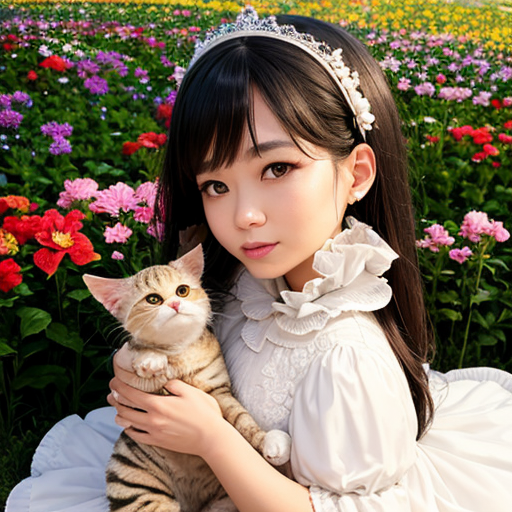
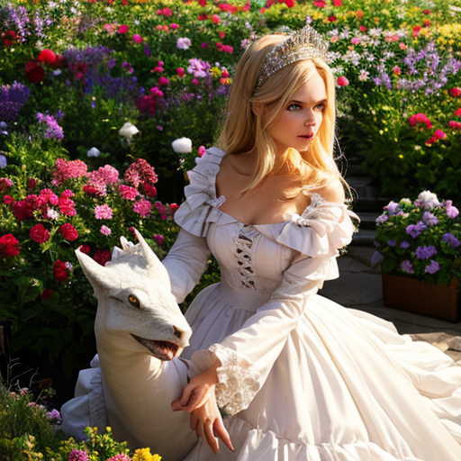

# EzP2P - Prompt-to-prompt extention of Web UI

## What's this?

This is an extension for [stable-diffusion-webui](https://github.com/AUTOMATIC1111/stable-diffusion-webui) that adds a custom script, which let you to use [prompt-to-prompt](https://github.com/google/prompt-to-prompt).

## Examples

Make *a cat* to *a dragon*.

```
Setting:
  Sampling method: DPM++ 2M Karras
  Sampling steps: 15
  Size: 512x512
  CFG Scale: 6.0
  Seed: 1

Original:
  Prompt:   close up of a cute girl holing a cat in flower garden, insanely excess frilled white dress, small tiara
  Negative: (low quality, worst quality:1.4)

Prompt-to-prompt:
  Prompt:   close up of a cute girl holing a dragon in flower garden, insanely excess frilled white dress, small tiara
  Negative: (low quality, worst quality:1.4)
```

- Original output:



- P2P output:


